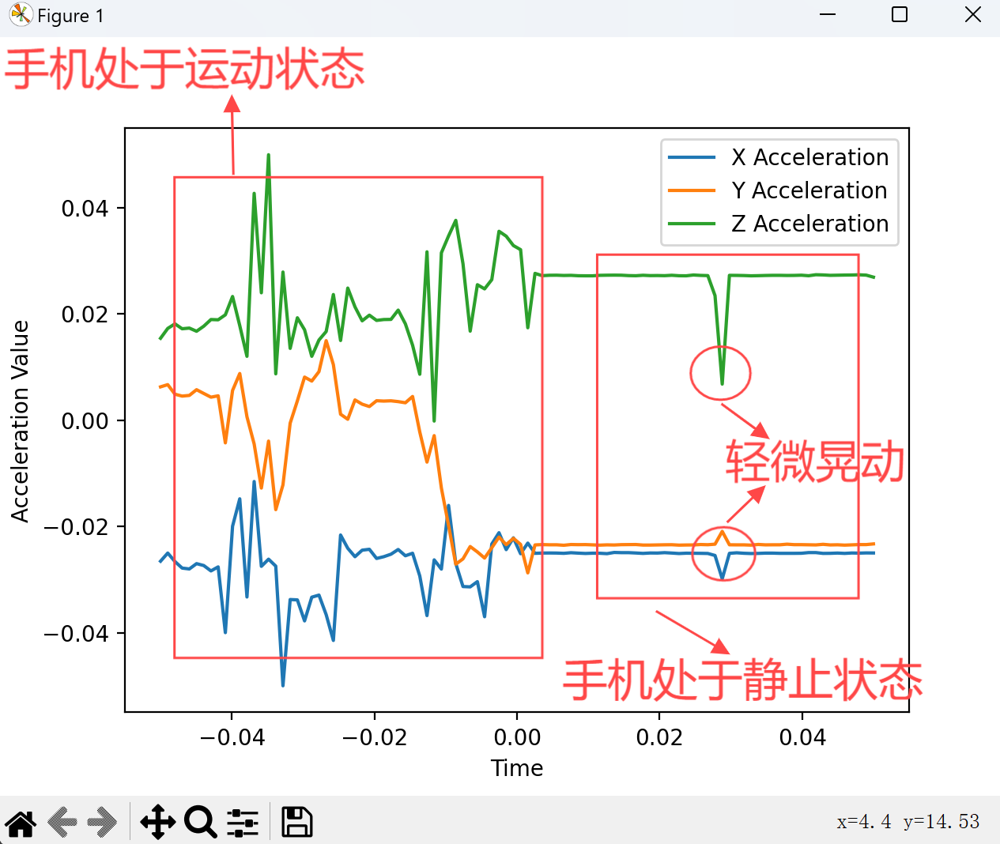

# 软件使用说明

## 1. 安装与配置

### 1.1 服务器端配置
- 确保在计算机上安装了 Python 3.11 及以上版本。
- 确保计算机与手机在同一局域网内，在计算机终端运行 `ipconfig` 获取本机 IP 地址。
- 在 PyCharm 中打开服务器端代码，并安装所需的依赖库（如 matplotlib 和 socket）。
- 运行服务器端代码，记下计算机局域网 IPv4 地址和端口号（默认为 5050）。

### 1.2 手机客户端配置
- 确保 Android 手机安装了 QPython，并配置 Python 3 环境，确保安装相关库（SL4A 库）。
- 确保手机与计算机处于同一局域网。
- 将客户端代码传输到手机 QPython 的脚本目录中。
- 编辑客户端脚本，确保 `server_ip` 和 `server_port` 对应服务器端的 IP 地址和端口号。

## 2. 使用步骤

### 2.1 启动客户端
- 打开 QPython，运行客户端代码。
- 客户端会自动尝试连接服务器端，连接成功后会开始传输传感器数据。

### 2.2 启动服务器
- 打开 PyCharm，运行服务器端代码。确保程序运行时显示“Listening”的提示。

### 2.3 实时数据展示
- 在服务器端运行的界面，可以看到实时绘制的传感器加速度数据图（包括 X、Y、Z 三轴）。
- 图表每 10 毫秒刷新一次，显示最近 100 个数据点。

### 2.4 停止程序
- 如果需要停止运行，可以通过以下操作：
  - 在服务器端，按 `Ctrl+C` 终止程序，服务器会自动关闭连接。
  - 在客户端，停止 QPython 中的脚本运行，客户端会自动释放资源。

## 3. 注意事项

### 3.1 网络连接
- 确保手机与电脑在同一个局域网内，且防火墙允许通信。
- 如果网络不稳定，可能会导致连接中断，此时需要重新运行客户端脚本。

### 3.2 启动顺序
- 由于安卓系统限制，请确保先运行手机端程序再运行计算机端。

### 3.3 数据格式
- 本程序仅处理三轴加速度数据（X、Y、Z）。如果需要扩展功能（如 GPS 数据传输），需修改客户端和服务器端代码。

### 3.4 资源管理
- 程序结束时，请确保客户端和服务器端均已停止运行，避免资源未释放导致问题。

### 3.5 扩展功能
- 用户可根据需求添加其他传感器（如陀螺仪、光线传感器）数据的获取与传输。
- 数据可视化部分可增加其他图形展示方式，如动态 3D 图形或历史数据存储。

## 4. 运行效果
# mobile_sensor_data
